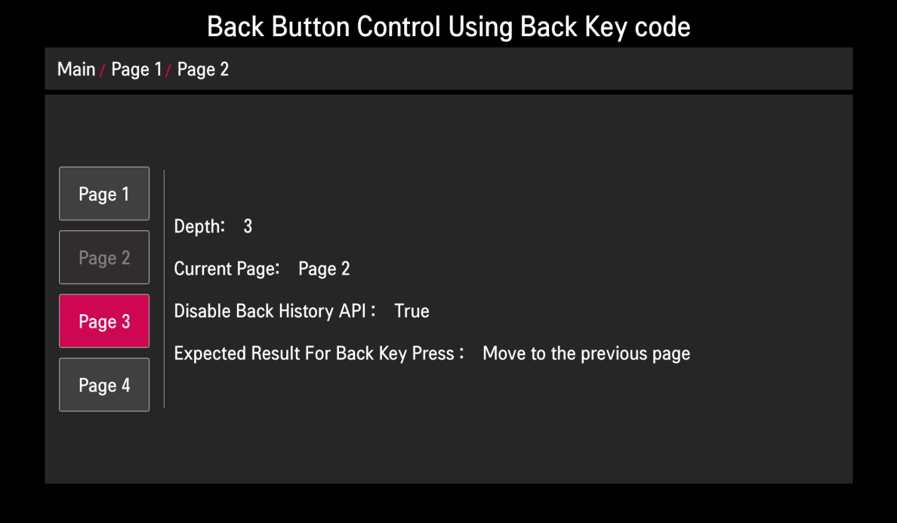

# Back Button Control
For webOS TV, a back button control function based on the browser history is supported through the use of the DOM's history object. The current app on the webOS TV screen can move to the home UI of webOS TV or previous page of the app with the back button of a remote control.

To understand the Magic Remote and its keycode usage, see [Magic Remote](https://webostv.developer.lge.com/develop/guides/magic-remote).

## How to Use History Object: pushState and popState Event
For back button control by Magic Remote, you can use the history object to push state (pushState) onto the history stack as below code:

```javascript
document.addEventListener(
  'click',
  function (event) {
    var title;

    clearPoppedData();
    event.preventDefault();

    if (event.target.nodeName === 'A') {
      stackElement = event.target.innerHTML;
      history.pushState(stackElement, '', event.target.href);
      pushData(stackElement);
    }
  },
  false
);
```

In the above code, the event.preventDefault() method is added because the default action of the event should not be triggered when this method is called. The pushState() method creates a new history entry and the new state.

Whenever the user navigates to the new state, the `popstate` event is fired, and the state property of the event contains a copy of the history entry's state object. It means that the webOS TV screen moves to the previous screen in the app when users press the back button. Otherwise, when the stack is empty, control passes to the Home screen.

You can add the addEventListener() method to handle the `popstate` event into the window object as below code:

```javascript
window.addEventListener(
  'popstate',
  function (event) {
    var data = event.state;
    if (data) {
      popData(data);
    } else {
      initResult();
    }
  },
  false
);
```

## Result in the webOS TV
You can launch and see the sample app result in the webOS TV or webOS TV Simulator as below image.



