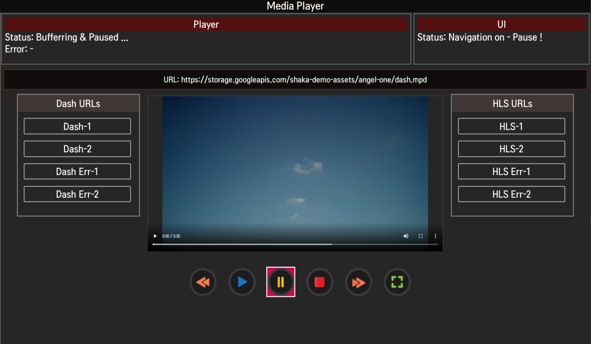

# Media Playback
This sample app shows how to implement media playback in a web app. This sample app uses shaka player, Dash and HLS URLs. For more information about supported media and DRM protocols, see [Streaming Protocol and DRM](https://webostv.developer.lge.com/develop/specifications/streaming-protocol-drm).

## Result in the webOS TV
You can install the sample app and see the results in the webOS TV or webOS TV Simulator as in the following image.

## References
* Media Source Extensions https://www.w3.org/TR/media-source/#introduction
* HLS vs DASH https://www.wowza.com/blog/hls-vs-dash
* Shaka Player https://github.com/shaka-project/shaka-player
